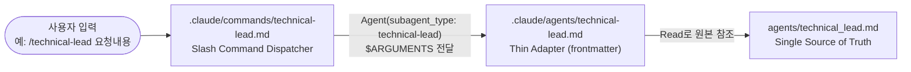
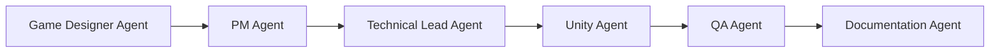

# AI Agent System Architecture

> agents/*.md의 역할 정의가 Claude Code 서브에이전트와 Slash Command로 이어지는 3단 구조입니다.

---

# Overview

GameDev-Platform은 6개 역할(Technical Lead, PM, Documentation, Unity, QA, Game Designer)을 AI Agent로 운영합니다.

이 Agent들은 세 개의 계층으로 나뉘며, 각 계층은 서로 다른 목적을 가집니다.



| 계층 | 위치 | 역할 |
|---|---|---|
| 1. Source | `agents/*.md` | 역할 정의 본문(Mission, Principles, Guidelines 등)의 유일한 원본 |
| 2. Adapter | `.claude/agents/*.md` | Claude Code 서브에이전트로 호출되기 위한 frontmatter(name/description/tools)만 담은 얇은 래퍼 |
| 3. Dispatcher | `.claude/commands/*.md` | `/{name}` Slash Command로 Adapter를 호출하는 로직 없는 진입점 |

---

# Layer 1: agents/*.md (Source of Truth)

`agents/` 디렉토리에는 6개 역할 정의 문서가 있으며, [agents/README.md](../../agents/README.md)가 이를 인덱싱합니다.

| Agent | File | 담당 |
|---|---|---|
| Technical Lead | `agents/technical_lead.md` | Architecture 설계, 기술 선택, 시스템 구조 검토 |
| PM | `agents/pm.md` | 일정 관리, 우선순위 결정, 작업 계획 |
| Documentation | `agents/documentation.md` | 문서 작성, ADR 작성, 회의록 정리, 지식 관리 |
| Unity | `agents/unity.md` | Unity 개발, C# 구현, Gameplay 시스템 작성 |
| QA | `agents/qa.md` | 테스트 계획, 버그 분석, 품질 검증 |
| Game Designer | `agents/game_designer.md` | 게임 컨셉 설계, Gameplay Loop, 시스템 기획 |

이 문서들은 지금까지 "대화 중 참고하는 역할 가이드"로 쓰였으나, [ADR 0001](../decisions/0001-agent-adapter-strategy.md) 이후로는 Claude Code 서브에이전트 호출의 원본이기도 합니다.

---

# Layer 2: .claude/agents/*.md (Thin Adapter)

각 Adapter는 본문을 복사하지 않고, frontmatter만 채운 뒤 원본을 Read로 참조하도록 지시합니다([ADR 0001](../decisions/0001-agent-adapter-strategy.md) Decision 1: Single Source of Truth 유지).

예시 (`technical-lead`):

```markdown
---
name: technical-lead
description: 기술 선택, 시스템/코드 구조 설계, 아키텍처 검토가 필요할 때 사용합니다.
tools: Read, Grep, Glob, Bash, WebSearch, WebFetch, mcp__sequential-thinking__...
---

이 Agent는 [agents/technical_lead.md](../../agents/technical_lead.md)에 정의된
Technical Lead 역할을 따릅니다.

작업 시작 전 반드시 위 파일을 Read로 읽고, Mission / Core Principles /
Decision Criteria / Communication Style / Expected Output을 그대로 적용합니다.
```

## Tool 권한 (Role Separation)

`tools` frontmatter는 Repository Write 권한을 Agent 역할에 맞게 제한합니다. MCP를 포함한 전체 목록은 [mcp-integration.md](mcp-integration.md)에서 다루고, 여기서는 네이티브 Tool 기준만 요약합니다.

| Agent | Write 권한 | 비고 |
|---|---|---|
| unity | ✓ (Read/Write/Edit) | 실제 구현 담당 |
| documentation | ✓ (Read/Write/Edit) | 실제 문서 작성 담당 |
| technical-lead | ✗ (Read only) | 분석/제안만, 구현은 Unity Agent에 위임 |
| pm | ✗ (Read only) | 계획/우선순위 제안만, 문서화는 Documentation Agent에 위임 |
| qa | ✗ (Read only) | 테스트/분석만, 버그 기록은 Documentation Agent에 위임 |
| game-designer | ✗ (Read only) | 기획/설계 제안만, GDD 작성은 Documentation Agent에 위임 |

각 `agents/*.md`에 이미 명시된 Collaboration 규칙(예: QA → Documentation Agent가 버그 기록)이 Write 권한 제거로 **구조적으로 강제**됩니다.

## 이름 규칙

kebab-case로 통일합니다: `technical-lead`, `pm`, `documentation`, `unity`, `qa`, `game-designer`. Layer 3의 Slash Command와 1:1로 매핑됩니다.

---

# Layer 3: .claude/commands/*.md (Slash Command Dispatcher)

[ADR 0002](../decisions/0002-slash-commands-strategy.md)에 따라, `Agent(subagent_type: "...")` 호출 방식의 진입 장벽(정확한 이름을 기억해야 함)을 낮추기 위해 Slash Command를 추가했습니다.

예시 (`/technical-lead`):

```markdown
---
description: Technical Lead Agent에게 아키텍처/기술 선택 관련 작업을 요청합니다.
argument-hint: [요청 내용]
---

Agent 툴로 subagent_type: "technical-lead"를 호출하고, 아래 요청을 그대로 전달하세요.

요청: $ARGUMENTS

$ARGUMENTS가 비어 있으면 사용자에게 어떤 기술적 검토가 필요한지 먼저 물어보세요.
```

Command는 **로직 없는 Dispatcher**로만 동작합니다. Tool 권한을 Command에서 재정의하지 않으며, Layer 2의 `tools` frontmatter가 유일한 권한 정의처입니다(두 곳에서 권한을 관리하면 어긋날 위험이 있기 때문).

| Slash Command | 호출 대상 |
|---|---|
| `/technical-lead` | subagent_type: technical-lead |
| `/pm` | subagent_type: pm |
| `/documentation` | subagent_type: documentation |
| `/unity` | subagent_type: unity |
| `/qa` | subagent_type: qa |
| `/game-designer` | subagent_type: game-designer |

---

# 왜 3단 구조인가

| 대안 | 기각 이유 |
|---|---|
| (A) 본문 전체 복사 | `agents/*.md`와 `.claude/agents/*.md`가 어긋날 위험 → Single Source of Truth 위배 |
| (B) 빌드 스크립트로 자동 생성 | 현재 단계에서는 과한 복잡성 (Simplicity 원칙 위배), Automation 단계에서 재검토 예정 |
| (C) Command가 서브에이전트 호출 없이 메인 대화에서 역할만 흉내 | ADR 0001의 Tool 권한 제한(Role Separation)이 적용되지 않음 |

3단 구조를 유지하는 이유는 다음 두 가지입니다.

1. **문서 중복 제거**: 역할 정의를 수정할 때 `agents/*.md` 한 곳만 고치면 된다.
2. **Human Decision 원칙의 구조적 강제**: Tool 권한 제한으로, 예를 들어 QA Agent가 실수로 코드를 수정하거나 PR을 병합하는 일이 애초에 불가능하다.

**제약**: 서브에이전트 호출이므로 메인 대화의 맥락이 전달되지 않는다(각 호출은 독립적인 새 대화로 시작). 짧은 질의는 Command 없이 "PM 관점에서 봐줘"처럼 요청하는 방식도 여전히 유효하다.

---

# Collaboration Flow

`agents/README.md`에 정의된 일반적인 게임 개발 흐름:



각 Agent는 자신의 전문 영역에 집중하며, 결과물의 최종 확정은 항상 사람이 수행합니다(Human Decision 원칙).

---

# Related Documents

| Document | Description |
|---|---|
| [ADR 0001](../decisions/0001-agent-adapter-strategy.md) | Agent Adapter 전략 |
| [ADR 0002](../decisions/0002-slash-commands-strategy.md) | Slash Command 전략 |
| [agents/README.md](../../agents/README.md) | 6개 Agent 역할 개요 |
| [mcp-integration.md](mcp-integration.md) | Agent별 MCP 접근 범위 |
