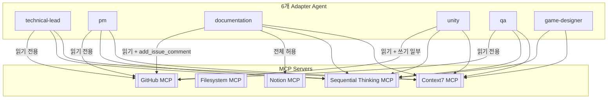

# MCP Integration Architecture

> 등록된 MCP 서버와 Agent별 접근 범위를 정리합니다.

---

# Overview

MCP(Model Context Protocol)는 Claude Code가 외부 시스템(GitHub, Notion 등)에 접근하는 표준 창구입니다. 프로토콜 자체와 서버 등록 절차는 [integrations/mcp/](../../integrations/mcp/README.md)가 원본(Single Source of Truth)이며, 본 문서는 **"어떤 Agent가 어떤 MCP에 접근할 수 있는가"**에 범위를 한정합니다.

---

# 등록된 MCP Server

| 서버 | 성격 | 상태 |
|---|---|---|
| GitHub | 읽기(이슈/PR/코드 조회)와 쓰기(PR 생성, 병합, 파일 push 등)가 한 서버에 혼재 | Connected |
| Filesystem | Repository 루트에 대한 읽기 + 쓰기(write_file, edit_file, move_file 등) | Connected |
| Sequential Thinking | 도구 1개(`sequentialthinking`), 부작용 없는 순수 추론 보조 | Connected |
| Notion | 읽기/쓰기 혼재 | Connected |
| Context7 | 도구 2개(라이브러리 문서 검색/조회), 부작용 없는 읽기 전용 | Connected — 6개 Agent 전체 허용 |
| Unity MCP | Unity Editor 상태 조회 + Editor 조작(Scene/Script 등) | Connected |

세부 등록 명령/인증 방식은 [integrations/mcp/servers.md](../../integrations/mcp/servers.md)를 참고합니다.

---

# Agent × MCP 접근 매트릭스

| Agent | GitHub MCP | Filesystem MCP | Sequential Thinking MCP | Notion MCP | Context7 MCP |
|---|---|---|---|---|---|
| technical-lead | 읽기 전용 | ✗ | ✓ | ✗ | ✓ |
| pm | 읽기 전용 | ✗ | ✓ | ✗ | ✓ |
| qa | 읽기 전용 | ✗ | ✓ | ✗ | ✓ |
| game-designer | ✗ | ✗ | ✓ | ✗ | ✓ |
| unity | 읽기 전용 + 쓰기 일부 | ✗ | ✓ | ✗ | ✓ |
| documentation | 읽기 전용 + `add_issue_comment` | ✗ | ✓ | 전체(`mcp__claude_ai_Notion__*`) | ✓ |

**읽기 전용 도구 목록** (공통): `get_file_contents`, `get_issue`, `get_pull_request`, `get_pull_request_comments`, `get_pull_request_files`, `get_pull_request_reviews`, `get_pull_request_status`, `list_commits`, `list_issues`, `list_pull_requests`, `search_code`, `search_issues`, `search_repositories`, `search_users`

**unity 전용 추가 쓰기 도구**: `create_branch`, `create_or_update_file`, `push_files`, `create_pull_request`, `add_issue_comment` (`merge_pull_request`, `create_repository`, `fork_repository`, `update_pull_request_branch`는 제외 — 병합·저장소 단위 조작은 사람이 최종 결정)

---

# 왜 이렇게 나눴는가 (Role Separation)

[ADR 0003](../decisions/0003-agent-mcp-access.md)의 결정을 요약합니다.

1. **Sequential Thinking → 전체 6개 Agent 허용**
   부작용이 없는 순수 추론 보조 도구이므로 Role Separation과 무관하게 안전합니다.

2. **Filesystem → 어느 Agent에도 부여하지 않음**
   - `unity`/`documentation`은 이미 네이티브 Read/Write/Edit로 동일 범위를 다루므로 중복입니다.
   - `technical-lead`/`pm`/`qa`/`game-designer`는 [ADR 0001](../decisions/0001-agent-adapter-strategy.md)에서 의도적으로 Write를 배제했는데, Filesystem MCP는 write_file/edit_file을 포함해 부여 시 그 제한이 우회됩니다.

3. **GitHub → Agent 역할별 부분집합을 명시적으로 나열 (와일드카드 미사용)**
   `mcp__github__*` 와일드카드는 서버 안의 읽기/쓰기 도구를 구분하지 못합니다. 실제로 Unity Agent에 전체 와일드카드를 시도했을 때 Claude Code의 자동 권한 분류기가 "권한 상승 위험"으로 차단한 사례가 있습니다. 각 Agent의 역할(ADR 0001에서 정의한 "분석만/구현 담당" 등)에 맞는 부분집합만 명시적으로 열었습니다.

4. **Notion → Documentation Agent 전용 유지**
   기존 결정(Notion 작성 채널을 Documentation Agent로 일원화)을 그대로 따릅니다.

5. **Context7 → 6개 Agent 전체 허용**
   Sequential Thinking과 동일한 논리(부작용 없는 읽기 전용)로 전체 개방했습니다. 자세한 내용은 [ADR 0005](../decisions/0005-context7-mcp-access.md)를 참고합니다.

---

# Consequences

**장점**
- MCP 접근이 필요한 실무(코드/이슈 조사, Notion 문서화, PR 생성)를 각 Agent가 직접 수행할 수 있습니다.
- ADR 0001의 Role Separation이 MCP 영역까지 일관되게 이어집니다.

**단점 / 한계**
- GitHub 도구를 서버 단위가 아닌 개별 이름으로 나열해야 해서, 새 GitHub MCP 도구가 추가되면 각 Adapter를 수동으로 갱신해야 합니다.
- Filesystem MCP는 어떤 Agent도 사용할 수 없어, 향후 Repository 루트 바깥 파일이 필요해지면 별도 재검토가 필요합니다.
- `merge_pull_request` 등 배제한 쓰기 도구가 실제로 필요해지면 별도 ADR로 재논의합니다(현재는 사람이 직접 병합).

---

# Related Documents

| Document | Description |
|---|---|
| [ADR 0003](../decisions/0003-agent-mcp-access.md) | Agent별 MCP 접근 범위 상세 |
| [ADR 0005](../decisions/0005-context7-mcp-access.md) | Context7 MCP 전체 Agent 개방 결정 |
| [integrations/mcp/README.md](../../integrations/mcp/README.md) | MCP 프로토콜 개요 |
| [integrations/mcp/servers.md](../../integrations/mcp/servers.md) | 서버 등록 상세(Transport, 인증, 상태) |
| [agent-system.md](agent-system.md) | Agent 3단 구조 (네이티브 Tool 권한) |
