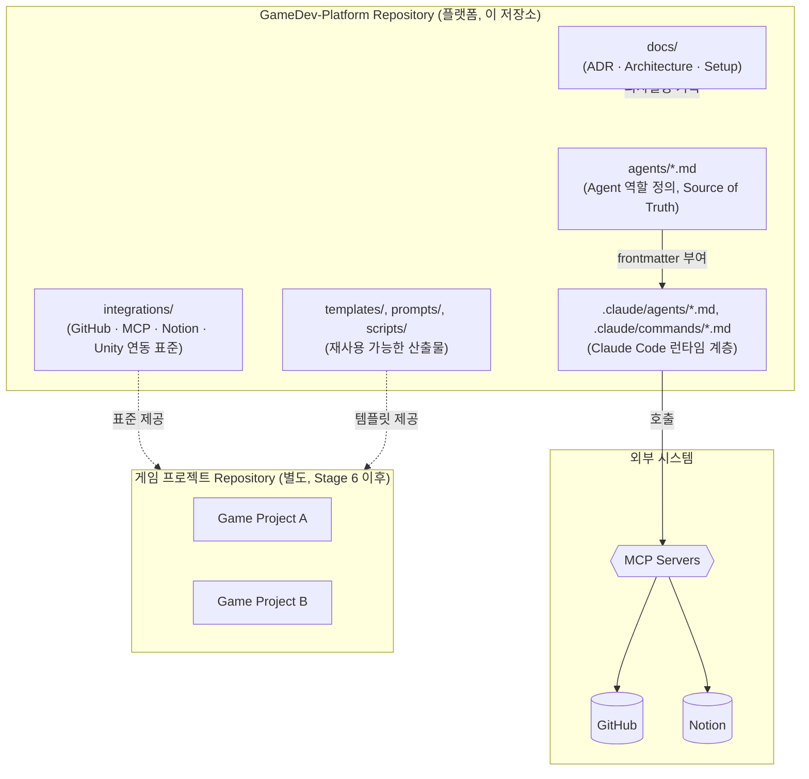

# Platform Architecture Overview

> GameDev-Platform은 게임이 아니라 게임을 만들기 위한 플랫폼입니다.

---

# Overview

`CLAUDE.md`가 명시하듯, 이 Repository의 목적은 "게임을 만드는 것"이 아니라 "게임을 만들기 위한 플랫폼을 구축하는 것"입니다.

실제 게임 프로젝트는 별도 Repository에서 개발되며(Roadmap Stage 6), GameDev-Platform은 그 게임 프로젝트들이 공통으로 시작할 수 있는 **표준·Agent·자동화·문서 체계**를 제공합니다.

---

# System Diagram



이 다이어그램의 핵심은 두 가지입니다.

1. **플랫폼 내부**: `agents/*.md`(정의) → `.claude/`(Claude Code 런타임) → MCP를 통한 외부 시스템 접근이 하나의 흐름으로 연결됩니다. 자세한 내용은 [agent-system.md](agent-system.md), [mcp-integration.md](mcp-integration.md)를 참고합니다.
2. **플랫폼과 게임 프로젝트의 관계**: GameDev-Platform은 게임 코드를 직접 담지 않고, `integrations/`의 표준과 `templates/`의 산출물을 통해 별도 게임 Repository에 "표준을 공급"하는 역할만 합니다.

---

# Repository Structure

```text
GameDev-Platform
│
├── agents/           # Agent 역할 정의 (Source of Truth)
├── docs/             # ADR, Architecture, Setup, Workflow, Troubleshooting
├── integrations/     # GitHub / MCP / Notion / Unity / Claude Code 연동 표준
├── prompts/          # 재사용 가능한 Prompt (Planned)
├── scripts/          # 환경 설정/점검 자동화 (setup.sh, check_environment.sh)
├── templates/        # 재사용 가능한 프로젝트 템플릿 (Planned)
│
├── .claude/
│   ├── agents/       # agents/*.md의 Thin Adapter (Claude Code 서브에이전트)
│   └── commands/     # Slash Command Dispatcher (/pm, /unity 등)
│
├── README.md
├── CLAUDE.md
└── .gitignore
```

> `.claude/` 하위는 `README.md`의 최상위 트리에는 없지만, [ADR 0001](../decisions/0001-agent-adapter-strategy.md)의 `.gitignore` 변경 이후 Git에 포함되어 실질적으로 플랫폼 구조의 일부입니다.

---

# Design Principles (CLAUDE.md로부터)

아키텍처 수준에서 다음 원칙이 일관되게 적용됩니다.

| 원칙 | 아키텍처 적용 사례 |
|---|---|
| Documentation First | 모든 구조 변경 전 ADR 작성 (0001~0003) |
| Reusability First | Agent 정의는 특정 게임이 아닌 플랫폼 전역에 재사용 |
| Automation First | `scripts/setup.sh`, Slash Command Dispatcher |
| Simplicity | Command는 로직 없는 Dispatcher, MCP는 Least Privilege로 제한 |

---

# Roadmap Mapping

| Stage | 내용 | 현재 아키텍처와의 관계 |
|---|---|---|
| Stage 1 | Development Environment | `integrations/*/setup.md`, `scripts/` |
| Stage 2 | AI Environment | `agents/*.md`, `.claude/agents`, `.claude/commands`, MCP 4종 연동 (ADR 0001~0003) |
| Stage 3 | Documentation Platform | `docs/architecture/`(본 문서), `docs/decisions/`, Notion 연동 |
| Stage 4 | Unity Starter Template | `integrations/unity/`(스펙 확정, ADR 0004). 스펙은 `game/` 프로젝트 생성으로 처음 실물 적용됨(ADR 0007) |
| Stage 5 | Team Collaboration | `integrations/github/workflow.md`(Branch/PR 표준), `docs/team/`(팀 운영 절차), `.github/`(Issue·PR 템플릿, CODEOWNERS), `scripts/setup_team_member.sh`. 5인 팀 PR 기반 협업으로 전환 (ADR 0006) |
| Stage 6 | First Game Project | `game/` — Unity 6000.3.22f1 + URP(2D) + Photon Fusion 2. `integrations/photon/`이 네트워킹 표준 (ADR 0007) |

현재(2026-09-02 기준) Stage 1~4는 완료되었고, **Stage 5(Team Collaboration)와 Stage 6(First Game Project)이 동시에 진행 중**입니다. 팀원 5명이 이미 이 저장소를 clone한 상태에서 Unity + Photon Fusion 게임 개발을 시작하게 되어, 별도 게임 Repository를 만드는 대신 이 저장소의 `game/`에서 개발하고 운영 모델을 PR 기반으로 전환했습니다([ADR 0006](../decisions/0006-game-development-in-platform-repository.md), [ADR 0007](../decisions/0007-photon-fusion-multiplayer-stack.md)). 본 문서 세트는 Stage 3의 산출물입니다.

---

# Related Documents

| Document | Description |
|---|---|
| [agent-system.md](agent-system.md) | AI Agent 3단 구조 상세 |
| [mcp-integration.md](mcp-integration.md) | MCP 서버 및 Agent별 접근 범위 상세 |
| [README.md](../../README.md) | Repository 소개, 개발 철학, 기술 스택 |
| [CLAUDE.md](../../CLAUDE.md) | 프로젝트 전체 원칙 |
