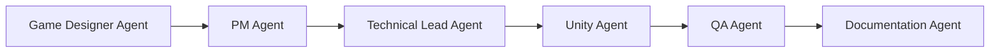

# Workflow

> GameDev-Platform에서 실제로 작업할 때 따르는 절차를 안내합니다.

---

# Overview

`docs/architecture/`가 "지금 플랫폼이 어떻게 구성되어 있는가"를 다룬다면, 이 문서는 "그 구조를 가지고 실제로 어떻게 일하는가"를 다룹니다.

절차 자체를 새로 정의하지 않고, `CLAUDE.md`와 `agents/*.md`에 이미 정의된 규칙을 작업 흐름 순서로 재구성한 **읽기용 안내서**입니다(Single Source of Truth는 각 원본 문서). 새 작업을 시작하기 전, 또는 Agent 협업 순서가 헷갈릴 때 이 문서를 먼저 확인합니다.

이 디렉토리는 단일 파일(`README.md`)로 유지합니다. 아래 4개 절차가 서로 강하게 이어지는 하나의 흐름(시작 → 협업 → 문서화 → Notion 반영)이라 분리하면 오히려 앞뒤 맥락을 놓치기 쉽고, `docs/architecture/`처럼 각 문서가 독립적으로 깊게 다뤄야 할 만큼의 분량도 아니기 때문입니다(Simplicity 원칙). 분량이 늘어나 한 파일로 찾기 어려워지면 그때 하위 파일로 분리합니다.

---

# 1. 작업 시작 절차

새 작업(기능 추가, 구조 변경, 문서 작성 등)을 시작할 때는 `CLAUDE.md`의 **Agent Usage Rules**를 따릅니다.

1. **문제의 목적 확인** — 무엇을, 왜 하는지 먼저 확인합니다.
2. **적절한 Agent 역할 선택** — 아래 [Agent Selection Guide](../../agents/README.md#agent-selection-guide)를 참고해 목적에 맞는 Agent를 고릅니다.
3. **필요한 경우 여러 Agent 관점 검토** — 하나의 결정이 여러 역할에 영향을 준다면(예: 새 시스템 도입은 Technical Lead + PM + QA 관점이 모두 필요) 순차적으로 관점을 모읍니다.
4. **결과 문서화** — 결정과 변경 사항은 Documentation Agent를 통해 기록합니다.

추가로 `CLAUDE.md`의 **Project File Rules**도 함께 적용합니다.

- 새로운 기능 추가 전 관련 문서 확인
- 중요한 구조 변경은 기록
- 반복 작업은 자동화 고려
- 프로젝트 구조 변경 시 Documentation 필요

---

# 2. Agent 협업 흐름

일반적인 게임 개발 작업은 [agents/README.md](../../agents/README.md#collaboration-flow)에 정의된 순서를 따릅니다.

| 단계 | Agent | 산출물 |
|---|---|---|
| 1 | Game Designer | 게임 컨셉, Gameplay Loop, 시스템 기획 |
| 2 | PM | 우선순위(Must/Should/Could/Won't), Sprint 계획, Action Item |
| 3 | Technical Lead | 아키텍처 결정, 기술 선택, 구조 검토 (ADR 대상 여부 판단) |
| 4 | Unity | 실제 구현 (C#, Gameplay 시스템) |
| 5 | QA | 테스트, 버그 분석, 품질 검증 |
| 6 | Documentation | 결정/변경 사항 기록, ADR 작성, Notion 반영 |

모든 작업이 이 6단계를 처음부터 끝까지 거치는 것은 아닙니다. 작은 문서 수정처럼 목적이 명확한 작업은 Documentation Agent만으로 충분하고, 기술 구조 검토처럼 특정 단계만 필요한 경우 해당 Agent만 사용합니다. 다만 **여러 역할이 걸친 결정**일수록 위 순서대로 관점을 거치는 편이 누락을 줄입니다.

Agent별 Write 권한 제한(예: PM/QA/Technical Lead/Game Designer는 Read only, 실제 코드·문서 작성은 Unity/Documentation Agent가 수행)은 이 협업 흐름을 구조적으로 강제합니다. 자세한 내용은 [docs/architecture/agent-system.md](../architecture/agent-system.md)를 참고합니다.

---

# 3. 문서화 워크플로우

## 3.1 무엇을 문서화하는가

`agents/README.md`의 **Documentation Required** 원칙에 따라, 다음 사항은 반드시 기록합니다.

- 기술 선택
- 구조 변경
- 개발 방향 변경
- 주요 시스템 설계

## 3.2 ADR을 언제 쓰는가

`docs/decisions/`의 기존 ADR(0001~0003)은 모두 다음 상황에서 작성되었습니다: **여러 대안을 검토한 뒤, 되돌리기 어렵거나 이후 결정의 전제가 되는 구조적 선택**을 할 때입니다(Agent를 서브에이전트로 변환하는 방식, Slash Command 도입 여부, Agent별 MCP 접근 범위 등).

ADR 작성 절차:

1. Technical Lead Agent(또는 논의 주체)가 대안과 결정을 정리합니다.
2. Documentation Agent가 `agents/documentation.md`의 **ADR Guidelines** 구조(Status / Context / Decision / Alternatives / Consequences)로 `docs/decisions/000N-{slug}.md`에 작성합니다. 번호는 기존 ADR에 이어 순차 부여합니다.
3. 결정이 다른 문서(예: `docs/architecture/*`)에 영향을 준다면 해당 문서도 함께 갱신합니다(Single Source of Truth 동기화).

일반적인 기능 추가나 버그 수정처럼 대안 비교가 필요 없는 변경은 ADR 없이 일반 문서(README, 기술 문서) 갱신만으로 충분합니다.

## 3.3 회의록 정리

`agents/pm.md`의 **Meeting Management**(Agenda → 내용 정리 → 결정 사항 → 담당자 지정 → 마감일 → Action Item)로 회의를 진행한 뒤, Documentation Agent가 `agents/documentation.md`의 **Meeting Documentation** 구조로 기록합니다.

- **Meeting Summary** — 회의 목적과 핵심 내용
- **Decisions** — 결정된 사항
- **Action Items** — 담당자 / 작업 내용 / 마감일
- **Open Questions** — 추가 논의 필요 사항

## 3.4 문서 품질 체크리스트

문서를 작성/수정한 뒤에는 `agents/documentation.md`의 **Quality Checklist**로 확인합니다.

- 목적이 명확한가?
- 대상 독자가 이해 가능한가?
- 필요한 예제가 있는가?
- 관련 문서 링크가 있는가?
- 최신 상태인가?

## 3.5 커밋 규칙

`CLAUDE.md`의 **Git Rules**를 따릅니다.

- 의미 있는 Commit Message 작성
- 기능 단위 Commit 권장
- 큰 변경 전 상태 기록

실무 관례로, 문서(`*.md`) 변경은 리뷰 후 별도 확인 없이 바로 커밋합니다. 다만 **push는 항상 사용자의 별도 확인을 거친 뒤에만 수행**합니다 — 로컬 커밋과 원격 반영을 분리해, 실수로 미완성 문서가 공유 브랜치에 올라가는 것을 방지하기 위함입니다.

---

# 4. Notion 워크플로우

Notion에 콘텐츠를 만들고 정리하는 절차는 [integrations/notion/workflow.md](../../integrations/notion/workflow.md)가 원본입니다. 여기서는 핵심 규칙만 요약하고, 상세 절차는 링크된 문서를 따릅니다(중복 방지, Single Source of Truth).

- Notion 쓰기(생성/수정/이동/Database 조작)는 **Documentation Agent 전용 채널**입니다. 메인 대화나 다른 Agent가 직접 Notion MCP 쓰기 도구를 호출하지 않습니다.
- 모든 신규 페이지·Database는 Base Page인 **🏠 Home** 하위에만 생성합니다.
- 새 항목 생성 시 Home 대시보드에 바로가기를 추가합니다.

---

# Related Documents

| Document | Description |
|---|---|
| [CLAUDE.md](../../CLAUDE.md) | 프로젝트 전체 원칙, Agent Usage Rules, Project File Rules, Git Rules |
| [agents/README.md](../../agents/README.md) | Agent Selection Guide, Collaboration Flow |
| [agents/pm.md](../../agents/pm.md) | Sprint Planning, Meeting Management, Risk Management |
| [agents/documentation.md](../../agents/documentation.md) | Documentation Standards, ADR Guidelines, Meeting Documentation, Quality Checklist |
| [docs/architecture/agent-system.md](../architecture/agent-system.md) | Agent 3단 구조와 Tool 권한 (협업 흐름이 구조적으로 강제되는 방식) |
| [docs/decisions/](../decisions/) | 기존 ADR 목록 |
| [integrations/notion/workflow.md](../../integrations/notion/workflow.md) | Notion 작성 채널 및 Base Page 규칙 (원본) |
